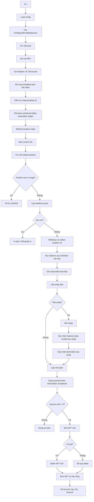

# Configured Pool Rebalancer - Báo Cáo V2

## 1. Mục Đích

`configured_pool_rebalancer` là worker dùng để tự động kiểm tra và rebalance các PancakeSwap V3 LP position đã cấu hình.

Hệ thống chỉ xử lý:

- Pool có trong file config.
- Position thuộc `managed_wallets` hoặc `bot_wallet`.
- Position tìm được từ cache, seed token id hoặc log MasterChef.
- Position đã ra ngoài range.

Mặc định hệ thống chạy `dry-run`, chỉ tính plan và in kết quả. Chỉ khi thêm `--execute`, worker mới gửi transaction thật.

## 2. Luồng Hoạt Động Chính

Sơ đồ Mermaid:



Luồng ngắn gọn:

```text
CLI
  -> load config
  -> mỗi pool:
      -> kết nối RPC
      -> tạo adapter + tx executor
      -> bổ sung metadata nếu thiếu token/fee/decimals
      -> kiểm tra swap pending cũ
      -> recovery job partial nếu có
      -> refresh position index
      -> đọc current tick
      -> mỗi position:
          -> in-range: bỏ qua
          -> out-of-range: lập plan
          -> dry-run: chỉ in plan
          -> live-run:
              -> withdraw / collect
              -> ghi reservation
              -> swap nếu cần
              -> xác nhận balance hoặc receipt sau swap
              -> mint
              -> stake
              -> burn NFT cũ nếu có thể
              -> ghi journal / log / Discord / PnL
```

## 3. Thành Phần Chính

| File                    | Vai trò                                                                      |
| ----------------------- | ----------------------------------------------------------------------------- |
| `cli.py`              | Entry point, parse CLI flags, chạy rebalance hoặc PnL report.               |
| `settings.py`         | Đọc JSON config, merge `wallets` + `pool_defaults`, validate giá trị. |
| `models.py`           | Định nghĩa config, position, plan, tx result, status.                      |
| `worker.py`           | Điều phối toàn bộ flow rebalance, recovery, Discord notify.              |
| `position_index.py`   | Tìm staked NFT position từ cache, seed token id hoặc MasterChef logs.      |
| `planner.py`          | Tính range mới, amount mint và swap plan.                                  |
| `adapter.py`          | Gọi contract PancakeSwap V3 MasterChef, NPM, ERC20 và swapper.              |
| `tx_executor.py`      | Build, sign, send transaction, quản lý nonce và gas.                       |
| `journal.py`          | Ghi trạng thái job, tx hash, snapshot balance và reservation ledger.       |
| `pnl_report.py`       | Tạo PnL report JSON/CSV, tính gas từ DB hoặc RPC receipt.                 |
| `discord_notifier.py` | Gửi PnL, pending snapshot và recovery required lên Discord.                |

## 4. Cách Tìm Position

Hệ thống không scan toàn bộ NFT trong ví. Nó tìm staked position theo thứ tự:

1. Cache riêng của module: `latest_farms/configured_pool_rebalancer/cache`.
2. Legacy cache: `latest_farms/positions_cache`, nếu `use_legacy_position_cache=true`.
3. `seed_token_ids` trong config.
4. `bootstrap_start_block`: sweep log MasterChef từ block này.
5. `auto_bootstrap_start_block=true`: tự tìm block tạo pool từ V3 Factory rồi sweep từ đó.

Local setup độc lập nên dùng:

```json
{
  "use_legacy_position_cache": false,
  "pool_defaults": {
    "auto_bootstrap_start_block": true
  }
}
```

Nếu không có cache, không có seed, không có bootstrap block và auto bootstrap thất bại, lần chạy đầu có thể không thấy position cũ.

## 5. Live Rebalance Làm Gì

Khi position out-of-range và chạy live-run:

1. Withdraw/collect liquidity và fee từ NFT cũ về `bot_wallet`.
2. Đọc balance sau withdraw với retry.
3. Ghi reservation ban đầu bằng đúng lượng token vừa thu hồi.
4. Lập swap plan nếu tỷ lệ token chưa phù hợp.
5. Swap nếu quote hợp lệ, price impact không vượt cap và không phải dust.
6. Sau swap, chờ RPC bắt kịp `receipt_block`, đọc balance nhiều lần và/hoặc xác nhận token output bằng receipt log.
7. Cập nhật reservation sau swap bằng net token movement, trừ token input đã gửi và cộng token output đã nhận.
8. Lập lại mint plan bằng reservation mới.
9. Đọc balance trước mint và clamp `amount0_desired/amount1_desired`.
10. Mint NFT position mới.
11. Stake NFT mới nếu pool có `pid`.
12. Burn NFT cũ nếu rỗng và `execute_burn=true`.

Các bước đọc balance với retry và clamp amount giúp tránh lỗi mint sai lượng thanh khoản, đặc biệt trên BASE.

## 6. Partial Recovery Và Reservation Ledger

Nếu job lỗi sau withdraw, NFT cũ có thể đã rời MasterChef nên lần chạy sau `PositionIndex` không còn thấy NFT đó. Vì vậy worker chạy recovery trước khi refresh position index.

Reservation ledger lưu lượng token thuộc về từng job:

- Sau withdraw: lưu `reserved_token0_raw`, `reserved_token1_raw`.
- Sau swap: trừ token input đã gửi, cộng token output thực nhận từ receipt log.
- Khi recovery: chỉ dùng lượng token đã reserve cho job đó, không dùng toàn bộ balance ví.
- Trước swap/mint: kiểm tra ví còn đủ cover tổng reservation của tất cả partial jobs trên cùng wallet/token.

Nguồn dữ liệu ưu tiên:

- Withdraw: ưu tiên ERC20 `Transfer` logs trong `withdraw_tx_hash`; balance delta chỉ là fallback/debug.
- Swap mới: ưu tiên receipt log để xác nhận token output; balance retry dùng để xác nhận RPC đã đồng bộ.
- Swap cũ đã có trong DB: nếu job có `swap_tx_hash` nhưng thiếu `post_swap` snapshot, worker sẽ reconcile reservation từ swap receipt trước khi quyết định thiếu token hay cần user xử lý thủ công.

Ví dụ swap cũ USDC -> POD:

```text
Reservation trước swap:
USDC = 1.979991
POD  = 0.010000

Receipt swap:
sent USDC     = 0.571685
received POD  = 123.456789

Reservation sau reconcile:
USDC = 1.408306
POD  = 123.466789
```

Ví dụ:

```text
Job A reserve 18 USDC
Job B reserve 30 USDC
Tổng reservation USDC = 48 USDC
```

Nếu ví còn `60 USDC`, recovery có thể tiếp tục. Nếu ví chỉ còn `20 USDC`, recovery bị chặn và trả `RECOVERY_REQUIRED`.

Policy recovery hiện tại:

| Trạng thái job                          | Cách recovery                                                             |
| ----------------------------------------- | -------------------------------------------------------------------------- |
| Withdraw xong, chưa có `swap_tx_hash` | Được phép swap nếu planner thấy cần.                                |
| Đã có `swap_tx_hash` thật           | Reconcile reservation từ swap receipt nếu cần, sau đó không swap thêm và chỉ mint từ reservation sau swap. |
| Mint xong nhưng stake lỗi               | Kiểm tra NFT mới thuộc bot wallet và đúng pool, sau đó stake lại. |
| Thiếu reservation ledger                 | Không tự recovery, yêu cầu xử lý thủ công.                         |
| Ví không đủ cover tổng reservation   | Không swap/mint, gửi recovery required nếu bật Discord.                |

Điểm quan trọng: nếu user đổi `rebalance_range` sau khi job partial, recovery có thể dùng range hiện tại để mint. Tuy nhiên nếu job đã swap thành công, worker sẽ reconcile từ `swap_tx_hash` rồi không swap thêm, nên không phát sinh swap lặp cho cùng một job.

## 7. Trạng Thái Job

| Status                 | Ý nghĩa                                                          |
| ---------------------- | ------------------------------------------------------------------ |
| `IN_RANGE`           | Position còn trong range, không làm gì.                        |
| `PLANNED`            | Đã tính plan cho position out-of-range.                         |
| `WITHDRAWN_UNBURNED` | Đã withdraw/collect NFT cũ, chưa hoàn tất mint/stake/burn.   |
| `SWAP_PENDING`       | Swap đã gửi nhưng chưa có receipt trong timeout.             |
| `SWAP_BLOCKED`       | Không swap được do quote, price impact, gas/RPC hoặc tx lỗi. |
| `MINTED_UNSTAKED`    | Đã mint NFT mới nhưng chưa stake thành công.                |
| `REMINTED`           | Đã mint và stake NFT mới thành công.                         |
| `BURNED`             | NFT cũ đã được burn.                                         |
| `FAILED`             | Lỗi không thể tiếp tục an toàn.                              |

Output có thể có `RECOVERY_REQUIRED` khi job partial không thể recovery tự động. Đây là tín hiệu để user kiểm tra journal, reservation và balance ví.

### Config Cần Nắm

Config nên dùng dạng v2:

```json
{
  "version": 2,
  "dry_run": true,
  "use_legacy_position_cache": false,
  "wallets": {
    "main": {
      "bot_wallet": "0x...",
      "private_key_env": "PARASITE_BOT_PRIVATE_KEY"
    }
  },
  "pool_defaults": {
    "dex_type": "pancake_v3_masterchef",
    "wallet": "main",
    "slippage_bps": 50,
    "max_swap_price_impact_pct": 1.0,
    "execute_burn": true,
    "auto_bootstrap_start_block": true
  },
  "pools": [
    {
      "name": "USDC-POP-0.25",
      "chain": "BAS",
      "pool_address": "0x...",
      "pid": 123,
      "bootstrap_start_block": null,
      "seed_token_ids": [],
      "rebalance_range": {
        "mode": "price_percent",
        "lower_percent": -10.0,
        "upper_percent": 20.0
      }
    }
  ]
}
```

Field quan trọng:

- `dry_run`: để `true` khi test. CLI `--execute` sẽ override thành live-run.
- `wallets`: khai báo wallet và tên biến môi trường chứa private key.
- `use_legacy_position_cache`: local độc lập nên để `false`.
- `pool_defaults`: cấu hình mặc định cho pool, nhưng không nên đặt `rebalance_range` ở đây.
- `pools`: danh sách pool cần quản lý.
- `managed_wallets`: nếu không khai báo, mặc định là `[bot_wallet]`.
- `rebalance_range`: phải đặt riêng trong từng pool.
- `gas_policy`: cap gas theo chain, đặc biệt với `BNB` và `BAS`.
- `discord`: chỉ khai báo tên env webhook, không ghi webhook thật vào config.
- `pnl.native_prices_usd`: giá fallback khi API giá lỗi.

### Set range percent cho từng pool

`rebalance_range` phải đặt trực tiếp trong từng pool vì mỗi pool có biến động, token ratio và chiến lược khác nhau.

```json
{
  "name": "USDC-POP-0.25",
  "chain": "BAS",
  "pool_address": "0x...",
  "pid": 123,
  "rebalance_range": {
    "mode": "price_percent",
    "lower_percent": -10.0,
    "upper_percent": 20.0
  }
}
```

Ý nghĩa:

- `mode="price_percent"`: tính range mới theo phần trăm giá quanh current tick.
- `lower_percent`: số âm, ví dụ `-10.0` là thấp hơn giá hiện tại khoảng 10%.
- `upper_percent`: số dương, ví dụ `20.0` là cao hơn giá hiện tại khoảng 20%.
- Nếu pool không khai báo `rebalance_range`, hệ thống fallback theo journal/snapshot hoặc giữ width cũ quanh current tick.

## 8. Hướng Dẫn Chạy Cho Người Mới

### Bước 1: Tạo config riêng

```powershell
copy latest_farms\configured_pool_rebalancer\sample_config.json my_rebalance_config.json
```

Sửa các field:

- `bot_wallet`
- `private_key_env`
- `pool_address`
- `chain`
- `pid`
- `rebalance_range`
- `gas_policy`
- `discord.webhook_url_env` nếu bật Discord

Không ghi private key hoặc webhook thật vào file JSON.

### Bước 2: Set private key bằng env

Trong PowerShell hiện tại:

```powershell
$env:PARASITE_BOT_PRIVATE_KEY="your_private_key"
```

Nếu bật Discord:

```powershell
$env:CONFIGURED_REBALANCER_DISCORD_WEBHOOK="your_discord_webhook"
```

Lưu ý: cách `$env:...` chỉ có hiệu lực trong PowerShell session hiện tại. Nếu chạy bằng Task Scheduler, nên set env ở cấp User/Machine hoặc load secret từ nơi an toàn.

Ví dụ set User env:

```powershell
[Environment]::SetEnvironmentVariable("PARASITE_BOT_PRIVATE_KEY", "your_private_key", "User")
[Environment]::SetEnvironmentVariable("CONFIGURED_REBALANCER_DISCORD_WEBHOOK", "your_discord_webhook", "User")
```

Sau khi set User env, hãy mở PowerShell mới hoặc restart Task Scheduler service nếu cần.

### Bước 3: Chạy dry-run trước

```powershell
python -m latest_farms.configured_pool_rebalancer.cli --config my_rebalance_config.json
```

Dry-run dùng để kiểm tra:

- Có tìm thấy position không.
- Position nào in-range/out-of-range.
- Range mới có đúng ý muốn không.
- Config pool/wallet có sai không.

### Bước 4: Chạy live-run

Chỉ chạy khi dry-run đã ổn:

```powershell
python -m latest_farms.configured_pool_rebalancer.cli --config my_rebalance_config.json --migrate --execute
```

`--migrate` tạo/cập nhật bảng journal. Nên dùng trong lần live-run đầu tiên và sau các bản update có thêm cột journal.

### Bước 5: Tạo PnL report

```powershell
python -m latest_farms.configured_pool_rebalancer.cli --config my_rebalance_config.json --pnl-report
```

Mặc định report ghi vào:

- `latest_farms/logs/configured_rebalancer_pnl.json`
- `latest_farms/logs/configured_rebalancer_pnl.csv`

Chỉ định format:

```powershell
python -m latest_farms.configured_pool_rebalancer.cli --config my_rebalance_config.json --pnl-report --pnl-format csv
```

PnL gas lookup hiện ưu tiên DB:

1. `transaction_history_v2_bk`
2. `transaction_history_v2`
3. RPC receipt fallback

Hash có hoặc không có prefix `0x` đều được normalize khi lookup gas.

### Bước 6: Chạy bằng script PowerShell

`run_configured_rebalancer.ps1` dùng để chạy worker và append output vào:

```text
latest_farms/logs/configured_rebalancer.log
```

Script nên làm các việc sau:

```powershell
Set-Location "D:\python\nft_projects"

$logDir = "D:\python\nft_projects\latest_farms\logs"
$logFile = Join-Path $logDir "configured_rebalancer.log"

$env:PYTHONIOENCODING = "utf-8"
[Console]::OutputEncoding = [System.Text.Encoding]::UTF8

$timestamp = Get-Date -Format "yyyy-MM-dd HH:mm:ss"
"[$timestamp] Starting configured_pool_rebalancer" | Out-File -FilePath $logFile -Append -Encoding utf8

python -m latest_farms.configured_pool_rebalancer.cli --config my_rebalance_config.json --migrate --execute >> $logFile 2>&1

$timestamp = Get-Date -Format "yyyy-MM-dd HH:mm:ss"
"[$timestamp] Done" | Out-File -FilePath $logFile -Append -Encoding utf8
```

Không hardcode private key hoặc Discord webhook thật trong script. Hãy dùng env đã set ở cấp User/Machine hoặc secret manager nội bộ.

### Bước 7: Chạy cronjob bằng Windows Task Scheduler

Mục tiêu: dùng Windows Task Scheduler để chạy file:

```text
D:\python\nft_projects\run_configured_rebalancer.ps1
```

với tần suất **mỗi 30 phút một lần**.

Trước khi tạo task, kiểm tra bằng PowerShell thường:

```powershell
cd D:\python\nft_projects
powershell.exe -NoProfile -ExecutionPolicy Bypass -File "D:\python\nft_projects\run_configured_rebalancer.ps1"
```

Sau đó mở log để chắc chắn script chạy được:

```text
D:\python\nft_projects\latest_farms\logs\configured_rebalancer.log
```

Tạo task:

1. Mở **Task Scheduler**.
2. Chọn **Create Task**.
3. Tab **General**:
   - Name: `Configured Pool Rebalancer`
   - Chọn **Run whether user is logged on or not** nếu cần chạy nền.
   - Chọn **Run with highest privileges** nếu môi trường Python/RPC cần quyền đầy đủ.
4. Tab **Triggers**:
   - New trigger.
   - Begin the task: `On a schedule`.
   - Daily.
   - Advanced settings: tick **Repeat task every: 30 minutes**.
   - For a duration of: `Indefinitely`.
5. Tab **Actions**:
   - Action: `Start a program`.
   - Program/script:
     ```text
     powershell.exe
     ```
   - Add arguments:
     ```text
     -NoProfile -ExecutionPolicy Bypass -File "D:\python\nft_projects\run_configured_rebalancer.ps1"
     ```
   - Start in:
     ```text
     D:\python\nft_projects
     ```
6. Tab **Settings**:
   - Tick **Run task as soon as possible after a scheduled start is missed**.
   - Tick **If the task fails, restart every** và chọn retry phù hợp.
   - Không nên bật nhiều instance song song. Chọn **Do not start a new instance** nếu task trước vẫn đang chạy.

Có thể tạo nhanh bằng command line:

```powershell
schtasks /Create `
  /TN "Configured Pool Rebalancer" `
  /SC MINUTE `
  /MO 30 `
  /TR "powershell.exe -NoProfile -ExecutionPolicy Bypass -File `"D:\python\nft_projects\run_configured_rebalancer.ps1`"" `
  /F
```

Ý nghĩa:

- `/SC MINUTE /MO 30`: chạy mỗi 30 phút.
- `/TR`: command thực tế Task Scheduler sẽ gọi.
- `/F`: ghi đè task cũ cùng tên nếu đã tồn tại.

Chạy thử task vừa tạo:

```powershell
schtasks /Run /TN "Configured Pool Rebalancer"
```

Xem trạng thái task:

```powershell
schtasks /Query /TN "Configured Pool Rebalancer" /V /FO LIST
```

Kiểm tra sau khi tạo task:

- Right click task -> **Run**.
- Xem `latest_farms/logs/configured_rebalancer.log`.
- Kiểm tra output có `Starting configured_pool_rebalancer` và `Done`.
- Kiểm tra env private key/webhook có được Task Scheduler đọc thấy không.

Nếu task chạy được bằng PowerShell thường nhưng lỗi trong Task Scheduler, thường là do:

- `Start in` chưa đặt đúng repo.
- User chạy task chưa có env private key.
- Python path khác giữa interactive shell và scheduled task.
- Task chạy song song khi job trước chưa xong.

## 9. Cách Đọc Output Và Log

Nguồn cần xem:

- Terminal output: JSON kết quả của lần chạy hiện tại.
- `latest_farms/logs/configured_rebalancer.log`: log chi tiết nếu chạy qua script.
- Bảng `configured_rebalance_jobs`: status, tx hash, range mới, reservation.
- PnL JSON/CSV: lời lỗ sau khi DB có snapshot mới.
- Discord: PnL completed, PnL pending hoặc recovery required nếu bật.

Log checkpoint quan trọng:

- `stage=post_withdraw`: balance trước/sau withdraw và reservation ban đầu.
- `stage=post_swap`: balance sau swap, amount planned và reservation sau swap.
- `stage=pre_mint`: balance trước mint và amount sau clamp.
- `reserved0` / `reserved1`: lượng token đang được reservation ledger giữ cho job.
- `recovery swap reservation reconciled`: job cũ đã có `swap_tx_hash`, worker đã sửa reservation từ swap receipt.

Dấu hiệu hệ thống đang chạy ổn:

- Log có cặp `Starting configured_pool_rebalancer` và `Done` đều đặn theo lịch.
- Output JSON trả `IN_RANGE` cho các position đang an toàn.
- Không có `ERROR`, `FAILED`, `SWAP_BLOCKED`, `RECOVERY_REQUIRED`.
- Nếu có rebalance, log đi đủ checkpoint `post_withdraw -> post_swap -> pre_mint`, sau đó không có lỗi mint/stake.
- Discord PnL gửi được và status cuối là `Active`, `REMINTED` hoặc `BURNED` tùy trạng thái DB/snapshot.

Ví dụ log chạy ổn định mỗi 30 phút:

```text
[2026-05-20 10:35:41] Starting configured_pool_rebalancer
[
  {
    "pool": "USDT-GENIUS-0.25",
    "state": "IN_RANGE",
    "tick": -8842,
    "token_id": 6848448
  },
  {
    "pool": "USDC-POP-0.25",
    "state": "IN_RANGE",
    "tick": 287199,
    "token_id": 2016109
  }
]
[2026-05-20 10:37:18] Done
```

Ý nghĩa:

- Task Scheduler đã gọi script thành công.
- Worker đọc được config, RPC và position index.
- Hai position hiện vẫn trong range nên worker không gửi transaction.
- Chu kỳ chạy mất khoảng 1-2 phút và kết thúc sạch bằng `Done`.

Ví dụ log rebalance khỏe mạnh:

```text
INFO configured_pool_rebalancer rebalance checkpoint
pool=USDC-POP-0.25 tokenId=2015973 stage=post_withdraw
recovered_after_withdraw0=2498455
recovered_after_withdraw1=29479787326089620
reserved0=2498455 reserved1=29479787326089620

INFO configured_pool_rebalancer waiting for RPC to reach swap receipt block
pool=USDC-POP-0.25 tokenId=2015973 attempt=1 latest_block=46215060 receipt_block=46215061

INFO configured_pool_rebalancer rebalance checkpoint
pool=USDC-POP-0.25 tokenId=2015973 stage=post_swap
recovered_after_swap0=1581707
recovered_after_swap1=2741410401268718790
planned_amount0_desired=1562643
planned_amount1_desired=2741410401268718592
reserved0=1581707 reserved1=2741410401268718790

INFO configured_pool_rebalancer rebalance checkpoint
pool=USDC-POP-0.25 tokenId=2015973 stage=pre_mint
available0_for_mint=1581707
available1_for_mint=2741410401268718790
clamped_amount0_desired=1562643
clamped_amount1_desired=2741410401268718592
```

Ý nghĩa:

- `post_withdraw`: token đã được thu hồi và reservation đã được ghi.
- `waiting for RPC`: worker đang chờ RPC BASE bắt kịp block chứa swap receipt.
- `post_swap`: swap đã mined, balance hoặc receipt sau swap được xác nhận.
- `pre_mint`: amount mint đã được clamp theo reservation/balance thật trước khi mint.

Ví dụ recovery job cũ đã swap nhưng reservation còn stale:

```text
INFO configured_pool_rebalancer recovery swap reservation reconciled
pool=USDC-POP-0.25 tokenId=2019344
tx=0xa59ef68000c4dce36dfb8149404102e21fc76798684b7918b322134e4e5aa380
old_reserved0=1979991 old_reserved1=10
sent0=571685 sent1=0 received0=0 received1=123456789
new_reserved0=1408306 new_reserved1=123456799
```

Ý nghĩa: job đã swap thành công từ chu kỳ trước. Worker không yêu cầu nạp thêm USDC theo reservation cũ, mà đọc receipt swap để trừ USDC đã gửi và cộng POD đã nhận, sau đó tiếp tục mint từ reservation mới.

Ví dụ Discord PnL notify khi rebalance/indexing đã ổn:

```text
**Configured Rebalancer PnL**
Pool: `USDC-POP-0.25` | Chain: `BAS`
Wallet: `0x9b73...4D8D`
NFT: `2013201 -> 2013280 -> 2015144 -> 2015973 -> 2016109`

Initial: `$2.9900`
Current LP: `$2.4800`
Gas: `$0.0817`
Module reward: `$0.1701`

Net PnL: `$-0.5917`
Net incl. reward: `$-0.4216`
Status: `Active`
```

Ý nghĩa:

- PnL reporter đã link được chuỗi NFT cũ -> NFT mới.
- DB đã có snapshot cho NFT hiện tại.
- Gas đã được tính từ `transaction_history_v2_bk` / `transaction_history_v2` hoặc fallback RPC.
- Discord webhook hoạt động.

Ví dụ Discord pending notify:

```text
**Configured Rebalancer PnL Pending**
Pool: `USDC-POP-0.25` | Chain: `BAS`
Wallet: `0x...`
NFT: `2015973 -> 2016109`
Rebalance completed, but `wallet_nft_position` has not indexed the new NFT snapshot yet.
PnL will be retried on the next worker cycle.
```

Ý nghĩa: rebalance đã xong nhưng indexer DB chưa có snapshot NFT mới. Đây chưa phải lỗi rebalance; chờ chu kỳ sau hoặc kiểm tra job snapshot.

Ví dụ Discord recovery notify cần xử lý:

```text
**Configured Rebalancer Recovery Required**
Pool: `USDC-POP-0.25` | Chain: `BAS`
Wallet: `0x...`
Old NFT: `2013280`
Reason: `missing reservation ledger for recovery; manual recovery required`

Worker stopped before swap/mint to avoid using the wrong token balance.
Manual review is required before this job can be closed or resumed.
```

Ý nghĩa: worker chủ động dừng để không dùng nhầm token trong ví. User cần kiểm tra journal/reservation/balance hoặc đóng job nếu đã xử lý thủ công.

Nếu gặp lỗi trên BASE sau swap, tìm các dòng:

```text
post-swap balance not confirmed
post-swap balance confirmation failed
zero mint amounts after pre-mint balance clamp
reservation coverage failed
missing reservation ledger
recovery swap reservation reconciled
```

## 10. Lỗi Thường Gặp

| Lỗi                            | Cách hiểu / cách xử lý                                                                                                                                                |
| ------------------------------- | -------------------------------------------------------------------------------------------------------------------------------------------------------------------------- |
| Không thấy position           | Kiểm tra cache,`seed_token_ids`, `bootstrap_start_block`, `auto_bootstrap_start_block`, `use_legacy_position_cache`.                                              |
| Missing private key env         | Chưa set biến môi trường trong `private_key_env`.                                                                                                                   |
| Signer mismatch                 | Position không thuộc `bot_wallet`; cần dùng đúng signer/owner.                                                                                                     |
| Gas too high                    | Gas vượt `max_fee_gwei` hoặc `max_gas_gwei`; cần đổi policy hoặc chờ gas giảm.                                                                                |
| Swap blocked                    | Quote không có, price impact cao, dust swap, gas/RPC hoặc tx lỗi.                                                                                                      |
| Swap pending                    | Swap đã gửi nhưng worker chưa nhận receipt; lần sau sẽ kiểm tra lại.                                                                                             |
| Post-swap balance not confirmed | RPC/balance sau swap chưa ổn định; nếu receipt log xác nhận token output thì worker vẫn có thể cập nhật reservation và đi tiếp.                              |
| Recovery required               | Job partial không thể recovery an toàn; kiểm tra `error`, reservation và balance ví.                                                                               |
| Missing reservation ledger      | Job cũ tạo trước bản reservation ledger; cần xử lý thủ công hoặc đóng journal nếu đã tạo position mới bằng tay.                                         |
| Reservation coverage failed     | Ví không đủ token để cover tổng reservation. Nếu job đã có `swap_tx_hash`, kiểm tra log reconcile; reservation có thể được sửa tự động từ swap receipt. |
| Missing PnL snapshot            | DB chưa có snapshot NFT mới; chờ indexer cập nhật rồi tạo report lại.                                                                                             |
| PnL gas warning                 | Kiểm tra tx hash trong journal và bảng `transaction_history_v2_bk`/`transaction_history_v2`; hash có/không có `0x` đều được normalize ở bản hiện tại. |
